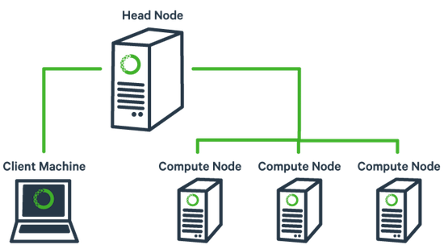

# Anaconda for Cluster Management

Anaconda for cluster management provides resource management tools to
easily deploy Anaconda across a cluster. 

## Overview

* It helps you manage multiple conda environments and packages (including Python and R) on bare-metal or cloud-based clusters. 
* Supported platforms include Amazon EC2, bare-metal clusters, or even a collection of virtual machines.
* Anaconda for cluster management can be used with distributed computation
frameworks such as Spark or Dask and works alongside enterprise Hadoop
distributions such as Cloudera CDH or Hortonworks HDP.

## Features

-   Easily install Python and R packages across multiple cluster nodes
-   Manage multiple conda environments across a cluster
-   Push local conda environments to all cluster nodes
-   Manage both cloud-based and bare-metal clusters
-   Remotely SSH and upload/download files to and from cluster nodes

## Document Index

Notes:

* [01 Quick-Start](./01_Quick_Start.md)
* [02 Installation](./02_Installation.md)
* [03 Configuration Overview](./03_Configuration_Overview.md)
* [04 Cluster Administration](./04_Cluster_Administration.md)
* [05 Cluster Conda](./05_Cluster_Conda.md)
* [06 Cluster Create on Bare Metal](./06_Cluster_Create_BareMetal.md)
* [07 Cluster Create in the Cloud](./07_Cluster_Create_Cloud.md)
* [08 Cluster Profiles](./08_Cluster_Profiles.md)
* [09 Cluster Provider](./09_Cluster_Provider.md)
* [10 Cluster Plugins](./10_Cluster_Plugins.md)
* [Spark Examples](./spark)

Supplemental:

* [Anaconda Cluster cheat sheet PDF](http://docs.continuum.io/_downloads/anaconda_cluster_cheat_sheet.pdf)
* [Clouder CDH](./cloudera-cdh.md)

## Glossary

Anaconda

>   A downloadable free, open source, high performance, optimized Python
    and R distribution with 100+ packages plus access to easily
    installing an additional 620+ popular open source packages for data
    science including advanced and scientific analytics. It also
    includes conda &lt;Conda&gt;, an open source package, dependency and
    environment manager. Thousands more open source packages can be
    installed with the `conda` command. Available for Windows, OS X and
    Linux, all versions are supported by the community.

Bare-metal cluster

>   On-site or in-house machines, collections of virtual machines
    (Vagrant, Docker, etc.), or previously instantiated cloud nodes.

Cloud-based cluster

>   A cluster that consists of machines in a cloud provider such as
    Amazon EC2.

Cluster

>   A group of computers that work in parallel to perform a single task.
    Also called "parallel computing" since the compute nodes can perform
    their operations in parallel.

Client machine

>   The laptop or workstation that contains Anaconda for cluster
    management and manages the cluster nodes.

Cluster file

>   The file that defines the configuration including the location of
    the head node, compute nodes, and
    authentication/configuration information.

Compute node

>   The machines managed by the head node that all work together to
    complete a single task.

Conda

>   Conda is an open source package management system and environment
    management system for installing multiple versions of software
    packages and their dependencies and switching easily between them.
    It works on Windows, Mac, and Linux. It was created for Python
    packages, but is able to package and distribute any software. Conda
    is included in all versions of Anaconda, Anaconda Server,
    and Miniconda.

Head node

>   A system configured to act as the intermediary between the cluster
    and the outside network. Can also be referred to as the master or
    edge node.

Miniconda

>   A minimal or "bootstrap" version of Anaconda. Installs only what you
    need to get conda running, including Python, conda, and
    its dependencies.

PEM key

>   Privacy enhanced electronic mail file, originally for email and now
    a general file format for cryptographic keys. In Anaconda for
    cluster management, this is used for cloud-based clusters and can be
    obtained from the cloud provider.

Plugin

>   In Anaconda for cluster management, plugins are analytics engines
    and management services that can be installed on a cluster.

Profile

>   A configuration file that defines how a cluster should
    be configured. It contains information about the number and types of
    cluster nodes, plugins, and other settings.

Provider

>   Configuration file that defines settings for cloud or bare
    metal providers. A provider is referenced by a profile and used to
    provision resources.

   
