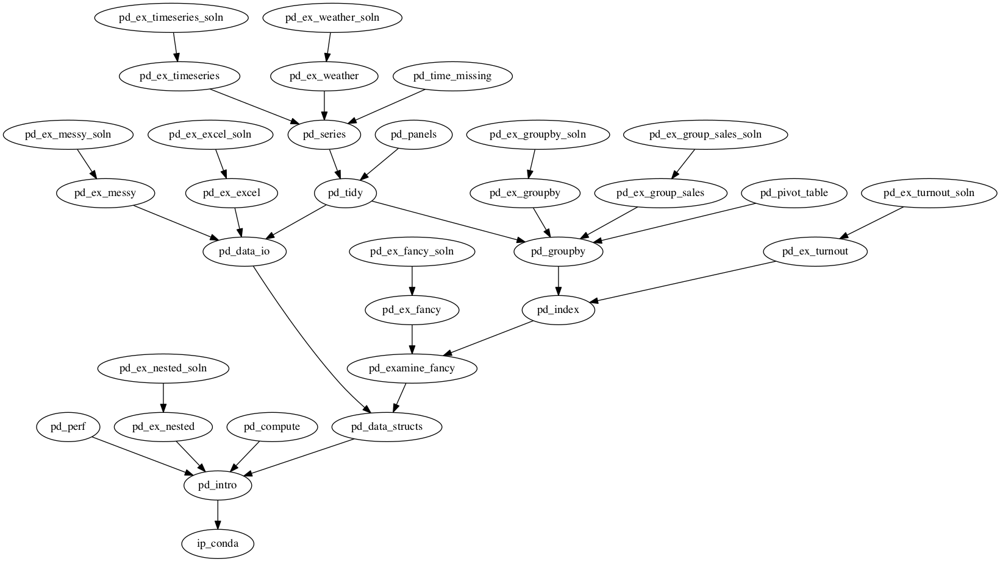

# README for Training Material on Pandas

This directory contains notebooks and other curriculum materials used for the Continuum Training on Pandas.

# Versions

## Old Material

* Most of the old material has been moved from `Training/TabularData` to `Training/Sources`.
* Some of that material may need to be repurposed as new exercises.

## New Material

* New version of course material is a work in progress.
* It was seeded by taking [Jeff Reback's notebooks](https://github.com/jreback/PyDataNYC2015/tree/master/tutorial) from a tutorial presented at PyData NYC 2015.

# Schedule and Pedagogy

## Dependencies
Only a very short introduction to Numpy can be considered *required* for the material in this directory. The goal is
to first introduce dtype, shape, vectorized computation and slice/fancy indexing without the complication of an Index
object.

Here's an example spec.

```yaml
Numpy I - Intro and Creation: [np_intro]
Numpy I - Indexing and Slicing: [np_slicing]
Numpy I - Vectorization: [np_vectorization]
Numpy I - Vectorization Exercise: [np_ex_vectorization]
Numpy I - Vectorization Solution: [np_ex_vectorization_soln]
Numpy I - Boolean and Fancy Indexing: [np_fancy]
```

## Pandas pedagogy and focus
The Pandas API is *huge* and there are several ways by which the same result can be generated using more or
less sophisticated or complex function calls. The exact reasons for this are unclear, but one can identify
a hierarchy of functions and techniques that can be used to guide the students towards particular solutions to
their problems.

One such hierarchy is that groupby can be used to automate multiple fancy indexing operations and that multiple
groupby operations can be expressed as a call to pd.pivot_table.

With this in mind fancy indexing followed by computation or aggregation can be considered to be the most essential
skill in Pandas.

In many notebooks `%timeit` cells are used demonstrate how to help the students choose an appropriate solution to their
problems. What has been discovered is that the Pandas API grows to provide access to highly optimized functions for the
ever-increasing set of popular operations performed on Series or DataFrames. In almost all cases a more general solution
can be built from simpler function calls. It should be highlighted that these examples are provided to show the students
where they improve their usage of Pandas for performance or re-usability of intermediate data.

## Proposed schedule
The notebooks have been divided and organized here such that a maximum of one hour is spent lecturing before
an exercise is presented. See the spec for complete details.

* Introduction
  * the Intro notebook is used to motivate usage Pandas to show simple one-line operations and plotting

* Indexing/slicing and Fancy Indexing
  * The two most important indexing operations:
    * always use .loc to select rows and, possibly columns
    * use dictionary-style to select a single column
    * other indexing styles may lead to confusion
    * *using .loc may also provide an easy way to understand copy vs view*
  * Fancy/boolean indexing may be wrapped under the same term

* Using Index objects
  * set appropriate index
  * show multi-level indexing using pd.IndexSlice
    * crosssection (.xs) can be used here, too
  * practice aligning data by index value

* Groupby
  * an extension of fancy indexing
  * Pivot tables provide access to layered groupby operations
  * timeit used to show the speed advantage of saving a groupby object compared to multiple fancy indexing

* Timeseries
  * show partial string indexing
  * resample is a special groupby for timeseries that includes frequency support
  * show merge/join operations to guide finding and filling in missing data
  * practice resample

* Wrap-up
  * show the available data reading and writing routines
  * show further computation and optimization techniques

# Recommended spec
```yaml
# Introduction
    Pandas - Introduction: [pd_intro]
    Pandas - Data Structures: [pd_data_structs]

# Selections
    Pandas - Examine Data: [pd_examine_fancy]
    Pandas - Fancy Index Exercise: [pd_ex_fancy]
    Pandas - Fancy Index Solution: [pd_ex_fancy_soln]

# Index object
    Pandas - Index Object: [pd_index]
    Pandas - Index exercise: [pd_ex_turnout]
    Pandas - Index Solution: [pd_ex_turnout_soln]

# Groupby
    Pandas - Groupby: [pd_groupby]
    Pandas - Groupby Exercise: [pd_ex_groupby]
    Pandas - Groupby Solution: [pd_ex_groupby_soln]
    Pandas - Sales data Exercise: [pd_ex_group_sales]      #finance
    Pandas - Sales data Solution: [pd_ex_group_sales_soln] #finance
    Pandas - Pivot Tables: [pd_pivot_table]
    Pandas - Tidy Input Data: [pd_tidy]

# Timeseries
    Pandas - Time Series Data: [pd_series]
    Pandas - Weather Exercise: [pd_ex_weather]
    Pandas - Weather Solution: [pd_ex_weather_soln]
    Pandas - Time Series Missing Data: [pd_time_missing] #finance
    Pandas - Time series exercise: [pd_ex_timeseries]
    Pandas - Time series solution: [pd_ex_timeseries_soln]

# I/O routines
    Pandas - Data IO: [pd_data_io]
    Pandas - Excel Files exercise: [pd_ex_excel]
    Pandas - Excel Files solution: [pd_ex_excel_soln]
    Pandas - Messy Data Exercise: [pd_ex_messy]
    Pandas - Messy Data Solution: [pd_ex_messy_soln]
    Pandas - Nested Data Exercise: [pd_ex_nested]
    Pandas - Nested Data Solution: [pd_ex_nested_soln]

# Wrapup
    Pandas - Computation: [pd_compute]
    Pandas - Performance optimzation: [pd_perf]
```

# Dependency Graph

