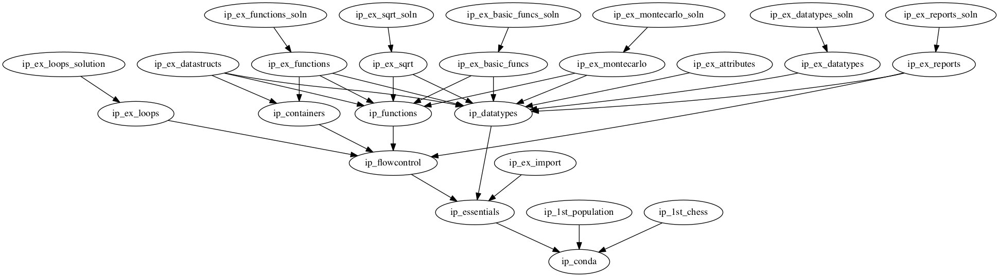

# Introduction/Basic Philosophy

This set of lectures and exercises is intended to take one day.

Points of consideration to justify this content:
* you can get by without comprehensions
* reading files gets to be tedious or highly specialized with many modules

Depending on audience:
* we need to get to Numpy and Pandas quickly
  * need to maintain interest and focus
* See Introduction/Intermediate for more notebooks
  * `../README.md` explains the separation

The formal name of this section is *Python Language Basics*


## Schedule

Conda and Interpreter:
 * if this takes longer than 1.5 hours something has gone wrong
 * sources of problems:
   * windows installs: just reinstall Anaconda
   * slow internet: don't conda install everything (python=3.4 and jupyter are enough)

First example:
 * Motivate students one of these workout examples
   * wheat and chessboard
   * compute population growth from UN data

Language essentials:
 * *know* how to import things
   * Include EX01 for practice
 * Understand that objects have attributes and methods

Data Types:
 * Strings, integers and floats
 * Arithmetic and Logical operators
 * Include EX02 and EX03
   * demonstrate implicit type conversion of numbers
   * practice a few string methods

----
Break for lunch
----

Flow Control:
 * looping and branching
 * indicate preference of `for` over `while`
 * include EX04 to practice loop-branch syntax

Functions:
 * position arguments
 * keyword arguments
 * default values
 * include EX05 for simple function practice

Containers (the heart of the afternoon):
 * simple demonstration of list, set, tuple and dict
   * how to add elements (if mutable)
   * simple arithmetic (set and list)
   * one or two member methods
     * .keys(), .items()
   * helpful builtins
     * sorted(), sum()
 * Slicing
   * just a few lines of examples
 * example of C in Python and a better way
   * make sure they *don't do this*

Exercises:
 EX06: looping over containers and writing functions

 Choose from one of the long exercises:
   * EX07 Choosing data structures
   * EX08 Report formatting
   * EX09 Estimate pi with Monte Carlo
   * EX10 Approximate Square Root
   * ... others can be added ...


## suggested yaml spec
Notebooks can be stitched together into notebooks of any size.
This spec is meant to show the *suggested order* of lecture notebooks and exercises.

```yaml
Conda and IPython: [ip_conda]
# Uncomment one of the following first examples
# Computing Population Growth: [ip_1st_population]
# Wheat and Chessboard: [ip_1st_chess]

Python Essentials: [ip_essentials]
Import Exercise: [ip_ex_import]
Basic Data Types: [ip_datatypes]
Numbers and Strings Exercises: [ip_ex_attributes, ip_ex_datatypes]

Flow Control: [ip_flowcontrol]
Loop Exercise: [ip_ex_loops]
Functions: [ip_functions]
Functions Exercise: [ip_ex_basic_funcs]
Data Containers: [ip_containers]
Containers Exercise: [ip_ex_functions]

# Uncomment entries below to from at least one of the following long exercises
# Choosing Data Structures: [ip_ex_datastructs]
# Report formatting: [ip_ex_reports]
# Estimate Pi: [ip_ex_montecarlo]
# Approximate Square Root: [ip_ex_sqrt]
```

## Dependency Graph

