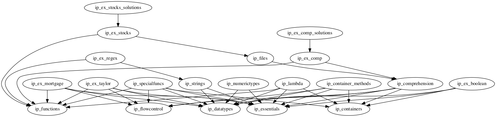

# Introduction/Intermediate

This folder contains material that is considered *Deeper Python Knowledge* than what
is presented in the `Introduction/Basic` notebooks.

The formal name of this section is *Python Language Basics: Deeper Knowledge*.

Notebooks from this directory can be interwoven between `Introduction/Basic` notebooks in
a course spec as the dependencies allow. In a limited number of cases these notebooks can
replace those in `Introduction/Basic`.

It is also possible to teach this material on the second day. A spec for this use case is
provided at the bottom of this document.

## Scalar Data Types
The following two notebooks can be provided in the course spec at any time after
`ip_datatypes` has been specified. For example, the spec in `Introduction/Basic` can be
augmented as follows

```yaml
Python Essentials: [ip_essentials]
Import Exercise: [ip_ex_import]
Basic Data Types: [ip_datatypes]
Numeric Types and Conversion: [ip_numerictypes]
Text Processing and Formatting: [ip_strings]
Strings Exercise: [ip_ex_attributes]
```

### NumericTypes
This notebook can augment the DataTypes content from `Introduction/Basic`.

Topics covered here:
* large integers
* overflow/underflow
* rounding errors
* complex numbers
* type casting and comparison

This notebook requires:
* `ip_datatypes`
* `ip_essentials`

### StringsAndFormatting
This notebook can augment the DataTypes content from `Introduction/Basic`.

Topics covered here:
* unicode strings
* member methods for text processing
* string slicing/indexing
* formatting
  * .format()
  * interpolation

This notebook requires:
* `ip_datatypes`
* `ip_essentials`

### ContainerMethods
This notebook explores the usage of container types (list, set, tuple and dict) in
great detail.

This notebook can take some time to teach thoroughly. It can be a great reference notebook even
if not explicitly taught.

Place this notebook after `ip_containers` and `ip_ex_functions`.

### Comprehension
There can be some debate about whether this notebook should belong in the Basic folder.
My rationale is that people learning Python can get by for a while without Comprehensions.

It is left to the instructor to decide how and when to introduce Comprehensions.

Place this notebook and the exercise after `ip_containers` and `ip_ex_functions`.

```yaml
Functions: [ip_functions]
Data Containers: [ip_containers]
Containers Exercise: [ip_ex_functions]
Comprehension: [ip_comprehension]
Comprehension Exercise: [ip_ex_comp]
```

*Note*: The instructor may also choose to have the students convert their
`for` loop answers in `ip_ex_functions` to Comphehensions as an additional exercise.

### BooleansAndComparisons
This exercise explores the thruthiness of Python scalars and containers.

This notebook requires:
* `ip_essentials`
* `ip_datatypes`
* `ip_containers`


### FilesAndIO and Stock Prices
Like Comprehension, it is recommended to teach this notebook, but not necessary.
If the students are more interested in using Pandas, you may have good cause to not
teach this notebook. That decision is left to the instructor.

This notebook requires the `ip_comprehension` appear before it in the spec. The
`Stock_Prices` example should appear after `FilesAndIO`.

```yaml
Comprehension: [ip_comprehension]
Comprehension Exercise: [ip_ex_comp]
Files and IO: [ip_files]
Stock Prices Exercise: [ip_ex_stocks]
```

### Lambda and Special Functions
These two notebooks should be taught after `ip_containers` due to their use of
tuples and dictionaries.

It is possible that Labmda Functions is the more useful notebook to teach since
they are used to great affect in Pandas methods.

The Taylor Series exercise can also be used at this point even if these two notebooks
are not being taught.


### Long Exercises
Two open-ended exercises are provided in this folder.

Regular Expressions requires:
* `ip_string` from this directory

Mortgage Calculator requires:
* `ip_functions` from Basic

## Example Spec
This example spec can be used in the of teaching the Intermediate notebooks on a
second day of Introduction to Python.

Tags are indented to show hierarchical order. If an outer tag is removed all of its
children tags must also be removed.
Otherwise, any or all of these notebooks can be taught.

```yaml
Scalar Data Types: [ip_numerictypes, ip_strings]
  Regular Expressions Exercise: [ip_ex_regex]

Container Methods: [ip_container_methods]

Boolean Comparisons Exercise: [ip_ex_boolean]

Comprehensions: [ip_comprehension, ip_ex_comp]
  Files and IO: [ip_files]
    Stock Prices Exercise: [ip_ex_stocks]

Lambda Functions: [ip_lambda]

Special Functions: [ip_specialfuncs]

Taylor Series Exercise: [ip_ex_taylor]

Morgage Calculator Exercise: [ip_ex_mortgage]
```

## Dependency Graph

