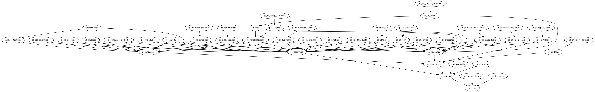

# Introduction to Python

This section of our training courses takes one to two days to complete.

Introduction to Python covers the following topics:
* Conda environments
* Importing modules
* Language Keywords
* Scalar Datatypes
* Looping and branching
* Functions and lambda functions
* Containers, iteration and comprehension
* File I/O (including pickle)
* Selected modules from the standard library


The notebooks have been divided into three categories to provide guidance and
flexibility when preparing a course spec.

## Basic
*Python Language Basics*

The notebooks in `Basic` are required to be taught in every course.
The instructor can choose from a few different example and exercise notebooks to suit
the course and the needs of the students.

See the README for more information on how to build a spec with this material.

## Intermediate
*Python Language Basics: Deeper Knowledge*

This `Intermediate` directory contains drop-in notebooks (and exercises) that can be used
to augment content already covered in the `Basic` notebooks.

For example, the `Basic` notebooks cover iteration with `for` but not comprehensions. The
comprehension notebook and exercise can be added at any point in the spec after `06_ContainersAndIteration`.

Almost every course should include the following `Intermediate` notebooks
* `04_Comprehension` and `EX02_Comprehension`
* `06_LambdaFunctions`

See the README for more information on how to build a spec with this material.

## Extras
*The Python Standard Library*


The `Extras` directory contains notebooks for Python Standard Library modules.
These notebooks should be short demonstrations of the data types from the Standard Library
that can be presented at any point in the spec after the Introduction notebooks.

The `01_Datetime` notebook is extremely useful to present. It can be presented during the Pandas
notebooks for maximum effectiveness.

See the README for more information on how to build a spec with this material.

## Course spec example
The following is an *example* spec.

```yaml
    Conda and IPython: [ip_conda]

    # Python Language Basics
    # choose one of the following
    Compute Population Growth: [ip_1st_population]
    # Wheat and Chessboard: [ip_1st_chess]

    Basic Python: [ip_essentials, ip_datatypes, ip_ex_import, ip_ex_datatypes, ip_ex_attributes]
    Flow Control and Functions: [ip_flowcontrol, ip_ex_loops, ip_functions, ip_ex_basic_funcs]
    Data Containers: [ip_containers, ip_ex_functions]
    # choose from among the following long exercises
    # Choosing Data Structures: [ip_ex_datastructs]
    # Report formatting: [ip_ex_reports]
    Estimate Pi: [ip_ex_montecarlo]

    # Intermediate Topics
    Scalar Data Types: [ip_numerictypes, ip_strings]
    Regular Expressions Exercise: [ip_ex_regex]
    Container Methods: [ip_container_methods]
    Boolean Comparisons Exercise: [ip_ex_boolean]
    Comprehensions: [ip_comprehension, ip_ex_comp]
    Files and IO: [ip_files]
    Stock Prices Exercise: [ip_ex_stocks]
    Lambda and Special Functions: [ip_lambda, ip_specialfuncs]
    Taylor Series Exercise: [ip_ex_taylor]
    Morgage Calculator Exercise: [ip_ex_mortgage]
    Approximate Square Root: [ip_ex_sqrt]

    # Standard Library
    Python Standard Library: [ip_standard, ip_datetime, ip_std_collections, ip_std_numeric]
```
## Dependency Graph

