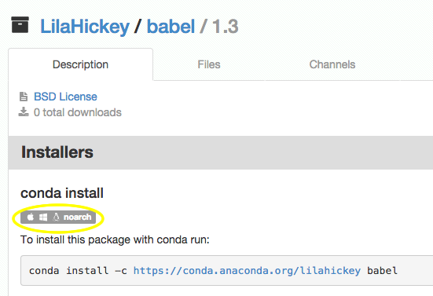

Cross platform ("Noarch") package support in Anaconda repository
================================================================

As of Anaconda repository version 2.6.0, your Anaconda repository
instance can support conda 'noarch' packages.

What Are Noarch packages?
-------------------------

The conda build system allows you to specify "no architecture" when
building a package, thus making it compatible with all platforms and
architectures. Noarch packages from your Anaconda repository instance
can be downloaded and installed on any platform.

How to Build Noarch packages
----------------------------

To specify a noarch build, simply add the following to the 'build'
section of your conda recipe's meta.yaml file:

    build:
        noarch_python: True

Additional examples can be found in the
[conda-recipes](https://github.com/conda/conda-recipes) repository on
github.

Uploading Noarch packages
-------------------------

Noarch packages can be uploaded to Anaconda repository in the same
manner as any other package:

    binstar upload babel

Noarch packages are identified on Anaconda repository by a
cross-platform icon:

> 
